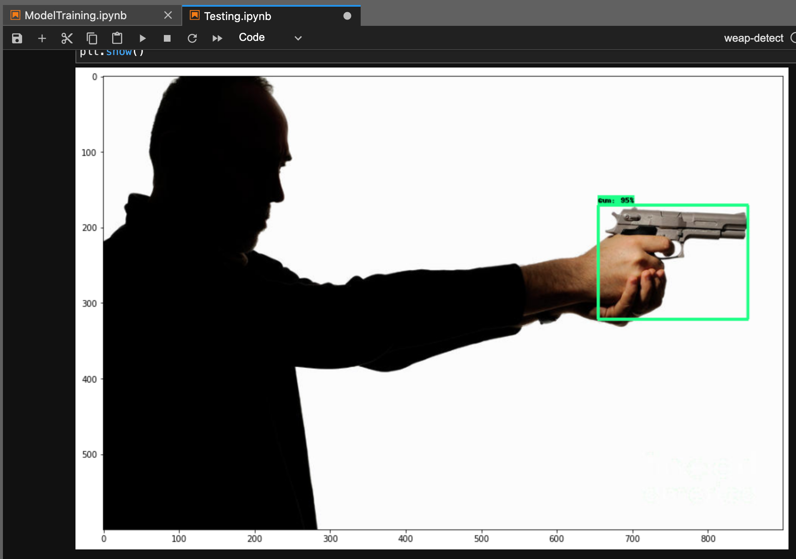
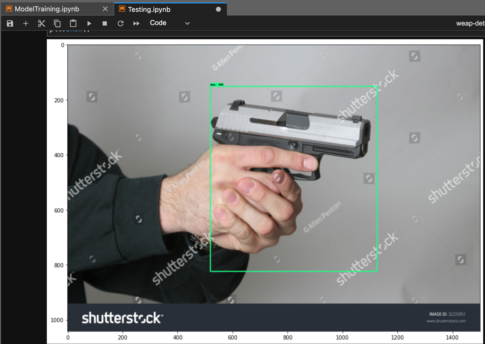
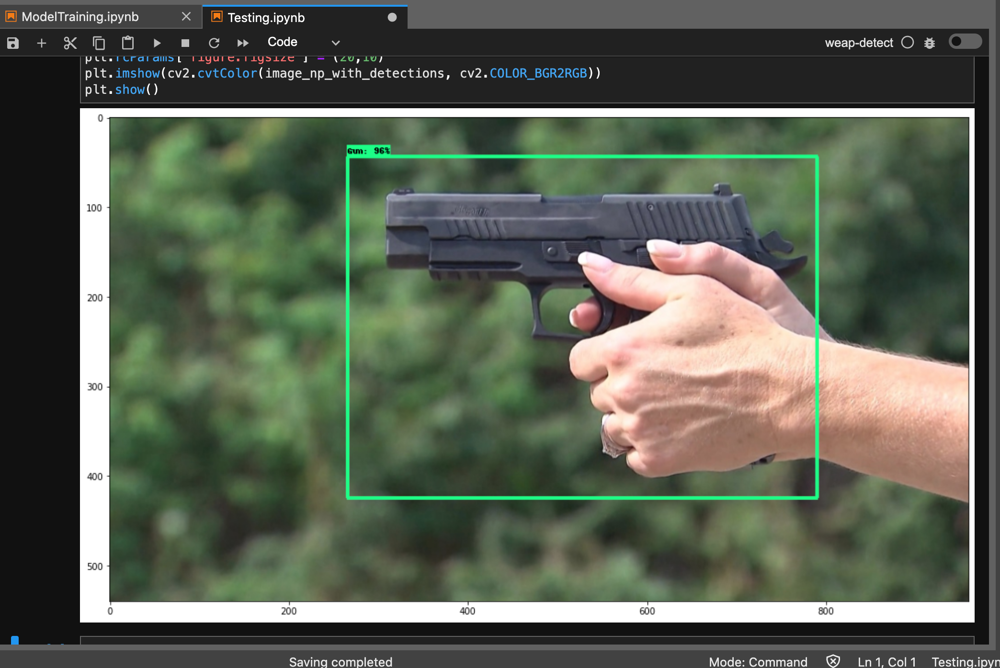

# Problem: Active Shooter Response Time

- It can take 10-20 minutes for the authorities to arrive at an active shooter incident.

https://www.guard911.com/the-difference-between-active-shooter-notification-time-response-time/

# Solution

- Develop an AI model that can detect someone with a weapon and notify the authorities instantly.

# Project Outline

1. Collect/clean/store image data

2. Train/Test/Develop Model

3. Deploy app where you can upload images

# Tools:

- Python

- AWS S3

- Airflow

- Docker

- Kubernetes

- LabelImg: https://github.com/tzutalin/labelImg

# Project Steps

## 1. Set up Notebook

```
% python -m venv weapon-detection                             # create virtual environment
% source weapon-detection/bin/activate                        # activate virtual environment
% python -m pip install --upgrade pip                         # upgrade pip version
% pip install ipykernel                                       # install ipykernel
% python -m ipykernel install --user --name=weapon-detection  # add virtual environment as a kernel
```

## 2. Collect and Store Image Data

- Pull image urls from Google API

- Store URL's in S3

- Download URL's using the links from S3

## 3. Annotate images

- copy all the images from the ImageCollection folder to ML folder

`% cp -a ImageCollection/images/*.jpeg  ML/images`

- Remove duplicate/unwanted images

- Annotate by hand all the images using LabelImg

## 4. Train Model with annotated images

- Get model from TensorFlow 2 Detection Model Zoo (SSD MobileNet V2 FPNLite 320x320)

This model will pre-process (resize, augmentation) our pictures and do post-processing for us.

- Install TensorFlow Object Detection API

## 5. Freeze/Save Model and Export to TFJS For Web App deployment

## 6. Test Model

### V1 Testing Results Using images model had never seen:







## 7. Deploy Data Collection/Storage to Airflow (running in a Docker container)

## 8. Deploy model as a Flask/React app to Docker and Kubernetes

# Sources/Resources

#### Tensorflow Object Detection in 5 Hours with Python | Full Course with 3 Projects

https://www.youtube.com/watch?v=yqkISICHH-U&list=PLFtcKdp22eiITi1D7Kxoba9ZLyaYsRLK8&index=3&t=6116s