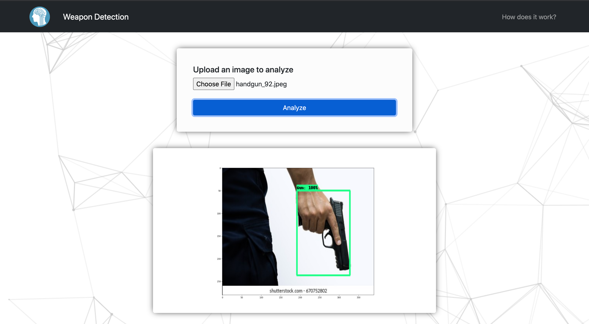
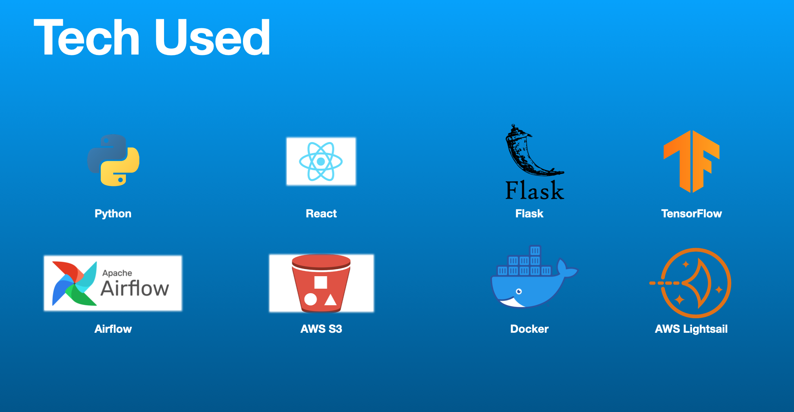
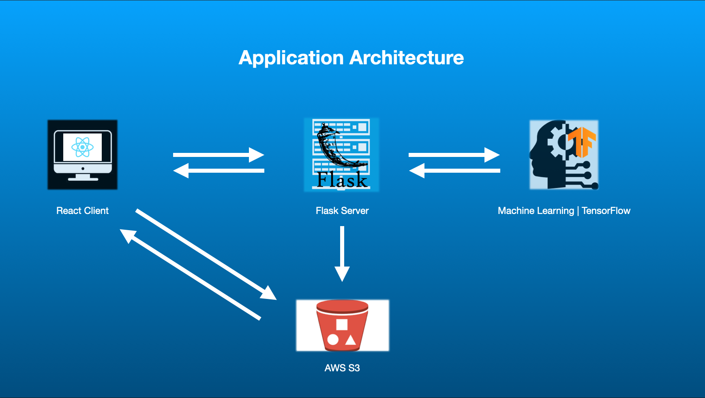
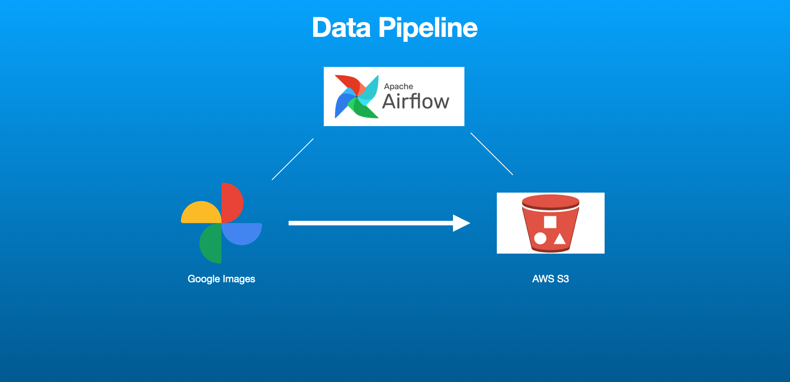
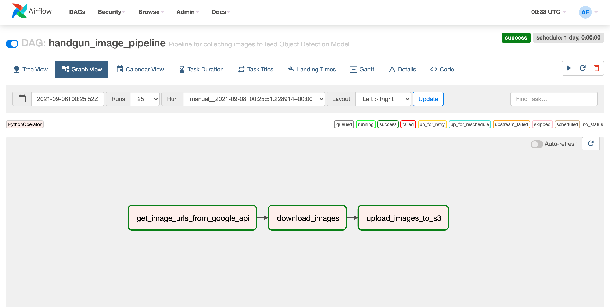

# Problem: Active Shooter Response Time

- It can take 10-20 minutes for the authorities to arrive at an active shooter incident even though average response time is
around 3 minutes.

https://www.guard911.com/the-difference-between-active-shooter-notification-time-response-time/

# Solution

- Develop an AI model that will monitor security cameras, instantly detect when a weapon is
drawn, and alert the authorities.

# Link to Application: http://weapon-detection-front-end.s3-website-us-east-1.amazonaws.com/



# Project Outline

1. Collect/clean/store image data

2. Train/Test/Develop Model

3. Deploy application

# Tools:



# Application Overview



# Project Steps

## 1. Set up Notebook

```
% python -m venv weapon-detection                             # create virtual environment
% source weapon-detection/bin/activate                        # activate virtual environment
% python -m pip install --upgrade pip                         # upgrade pip version
% pip install ipykernel                                       # install ipykernel
% python -m ipykernel install --user --name=weapon-detection  # add virtual environment as a kernel
```

## 2. Collect and Store Image Data | This is all automated using Airflow

- Pull image urls from Google API

- Store URL's in S3

- Download URL's using the links from S3

### Data Pipeline Overview





## 3. Annotate images | This is done manually using LabelImg

- copy all the images from the ImageCollection folder to ML folder

`% cp -a ImageCollection/images/*.jpeg  ML/images`

- Remove duplicate/unwanted images

- Annotate by hand all the images using LabelImg

cd into labelimg on computer and run `python lablelimg.py`

## 4. Train Model with annotated images | This is done in Jupyter Lab

- Get model from TensorFlow 2 Detection Model Zoo (SSD MobileNet V2 FPNLite 320x320)

This model will pre-process (resize, augmentation) our pictures and do post-processing for us.

- Install TensorFlow Object Detection API

## 5. Test Model | Initial testing done in Jupyter Lab

### Round 1 of testing in Jupyter Lab results:


## 6. Freeze/Save Model and Export

- This exported version of the model is what is deployed.

## 7. Deploy model using Flask, React, Docker, AWS Lightsail and AWS S3

### - Back-end was deployed using AWS Lightsail and Docker

### - Front-end was deployed using AWS S3

# Sources/Resources

#### Tensorflow Object Detection in 5 Hours with Python | Full Course with 3 Projects

https://www.youtube.com/watch?v=yqkISICHH-U&list=PLFtcKdp22eiITi1D7Kxoba9ZLyaYsRLK8&index=3&t=6116s

#### Flask Documentation

https://flask.palletsprojects.com/en/2.0.x/patterns/fileuploads/


#### LabelImg

https://github.com/tzutalin/labelImg

#### Deployment

https://aws.amazon.com/getting-started/hands-on/serve-a-flask-app/